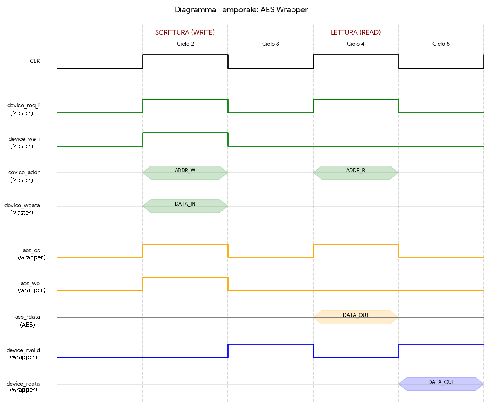

# AES Wrapper – Funzionamento e Protocollo Bus SoC

Questo documento descrive il funzionamento del modulo `aes_wrapper` che adatta l'interfaccia del core AES al protocollo bus del SoC.

## Panoramica del Wrapper

Il modulo `aes_wrapper` funge da interfaccia di adattamento tra:
- **Lato SoC**: protocollo bus standard con segnali di richiesta/risposta (`device_req_i`, `device_rvalid_o`)
- **Lato Core AES**: interfaccia semplice basata su registri (`cs`, `we`, `address`, `write_data`, `read_data`)

Il wrapper implementa un protocollo a latenza fissa di 1 ciclo, catturando i dati di lettura durante il ciclo di richiesta e presentandoli nel ciclo successivo con il segnale `rvalid`.

## Interfaccia del Wrapper

### Segnali del Bus SoC al Wrapper
- **`clk_i`**: Clock di sistema per tutte le operazioni sincrone
- **`rst_ni`**: Reset attivo basso, inizializza lo stato interno del wrapper
- **`device_req_i`**: Richiesta di transazione dal master del bus (attivo alto per 1 ciclo)
- **`device_addr_i[31:0]`**: Indirizzo byte della richiesta, utilizzato per decodificare il registro target
- **`device_we_i`**: Write enable - distingue tra operazioni di scrittura (1) e lettura (0)
- **`device_be_i[3:0]`**: Byte enable per scritture parziali (attualmente non utilizzato)
- **`device_wdata_i[31:0]`**: Dati di scrittura per le operazioni di write

### Segnali del Wrapper al Bus SoC
- **`device_rvalid_o`**: Segnale di validità risposta, alto per 1 ciclo nel ciclo successivo a ogni richiesta
- **`device_rdata_o[31:0]`**: Dati di lettura, validi quando `device_rvalid_o` è alto

### Segnali verso il Core AES (Interni)
- **`aes_cs`**: Chip select per il core AES, derivato da `device_req_i`
- **`aes_we`**: Write enable per il core AES, combinazione di `device_req_i` e `device_we_i`
- **`aes_address[7:0]`**: Indirizzo registro estratto da `device_addr_i[9:2]`
- **`aes_write_data[31:0]`**: Dati di scrittura passati direttamente dal bus
- **`aes_read_data[31:0]`**: Dati di lettura provenienti dal core AES

## Decodifica degli Indirizzi

**Mappatura Address Bus → Registro AES:**
Il wrapper estrae l'indice del registro dal bus address utilizzando la formula:
```
aes_address[7:0] = device_addr_i[9:2]
```

**Spiegazione della Decodifica:**
- `device_addr_i` è un indirizzo byte (32 bit)
- I bit [1:0] sono ignorati (allineamento a parola di 32 bit)
- I bit [9:2] diventano l'indice del registro (8 bit)
- Range supportato: 256 registri (indici 0x00-0xFF)


**Esempi:**
- Indirizzo bus 0x000 → Registro AES 0x00 (CONTROL)
- Indirizzo bus 0x004 → Registro AES 0x01 (STATUS)

## Generazione dei Segnali di Controllo

**Segnale Chip Select (aes_cs):**
```
aes_cs = device_req_i
```
Il chip select del core AES è direttamente collegato alla richiesta del bus. Ogni volta che il master del bus presenta una richiesta, il core AES viene selezionato.

**Segnale Write Enable (aes_we):**
```
aes_we = device_req_i & device_we_i
```
Il write enable del core AES è attivo solo quando c'è sia una richiesta sul bus (`device_req_i=1`) sia l'intenzione di scrivere (`device_we_i=1`). Per le operazioni di lettura, `aes_we` rimane basso.

**Passaggio Dati di Scrittura:**
```
aes_write_data = device_wdata_i
```
I dati di scrittura sono passati direttamente dal bus al core AES senza elaborazione.

## Protocollo di Timing e Gestione Operazioni AES

### Separazione tra Protocollo Bus e Timing AES
Il wrapper implementa un protocollo bus a latenza fissa di 1 ciclo, ma **NON** aspetta il completamento delle operazioni AES. Esistono due livelli temporali distinti:

**1. Livello Bus (Wrapper):** Latenza fissa 1 ciclo per tutte le transazioni
**2. Livello AES (Core):** Latenza variabile per operazioni di cifratura/decifratura. 

### Timing delle Operazioni di Scrittura (Accesso Registri)
**Ciclo N (Richiesta):**
1. Master presenta `device_req_i=1`, `device_we_i=1`, indirizzo e dati stabili
2. Wrapper genera `aes_cs=1`, `aes_we=1` verso il core AES
3. Core AES campiona indirizzo e dati sul fronte di salita del clock
4. Scrittura registro completata 

**Ciclo N+1 (Risposta Bus):**
1. Wrapper presenta `device_rvalid_o=1` (confermando l'accesso al registro)
2. Master può presentare una nuova richiesta se necessario

**NOTA**: La risposta conferma solo l'accesso al registro, non il completamento dell'operazione AES

### Timing delle Operazioni di Lettura (Accesso Registri)
**Ciclo N (Richiesta):**
1. Master presenta `device_req_i=1`, `device_we_i=0`, indirizzo stabile
2. Wrapper genera `aes_cs=1`, `aes_we=0` verso il core AES
3. Core AES presenta il dato su `aes_read_data` (valore attuale del registro)
4. Wrapper cattura `aes_read_data` in `captured_read_data` sul fronte di salita

**Ciclo N+1 (Risposta Bus):**
1. Wrapper presenta `device_rvalid_o=1` e `device_rdata_o=captured_read_data`
2. Master campiona i dati quando `device_rvalid_o` è alto

**NOTA**: Il dato letto rappresenta lo stato attuale del registro, non necessariamente il risultato finale


## Gestione dello Stato Interno

**Registro captured_read_data:**
Il wrapper mantiene un registro interno per catturare i dati di lettura:
- Aggiornato solo durante le operazioni di lettura (`device_req_i=1` e `device_we_i=0`)
- Mantiene l'ultimo valore letto fino alla successiva operazione di lettura
- Azzerato durante il reset (`rst_ni=0`)

**Registro device_rvalid_o:**
Il segnale di validità di risposta segue questo comportamento:
- Alto per esattamente 1 ciclo dopo ogni richiesta (sia read che write)
- Implementa un ritardo fisso di 1 ciclo tra richiesta e risposta
- Azzerato durante il reset

**Logica di Reset:**
Durante la fase di reset (`rst_ni=0`):
- `device_rvalid_o` viene forzato a 0
- `captured_read_data` viene azzerato a 0x00000000
- Al rilascio del reset, lo stato interno è pronto per le operazioni


## Sequenza Operativa Tipica



### Accesso Semplice ai Registri (1 Ciclo)
**Per Scrittura di un Registro:**
1. Master presenta richiesta di scrittura sul bus
2. Wrapper decodifica indirizzo e genera controlli per il core AES
3. Core AES aggiorna il registro target immediatamente
4. Wrapper conferma l'accesso con `device_rvalid_o=1` nel ciclo successivo

**Per Lettura di un Registro:**
1. Master presenta richiesta di lettura sul bus
2. Wrapper decodifica indirizzo e genera controlli per il core AES
3. Core AES presenta il valore attuale del registro richiesto
4. Wrapper cattura il dato e lo presenta con `device_rvalid_o=1` nel ciclo successivo

### Operazioni AES Complesse (Multi-Ciclo)
**Esempio Cifratura:**
1. Master scrive DATA_IN0-3 
2. Master scrive CONTROL con START=1 
3. **Core AES inizia elaborazione in background**
4. Master fa polling STATUS fino a DONE=1 
5. Master legge DATA_OUT0-3 
